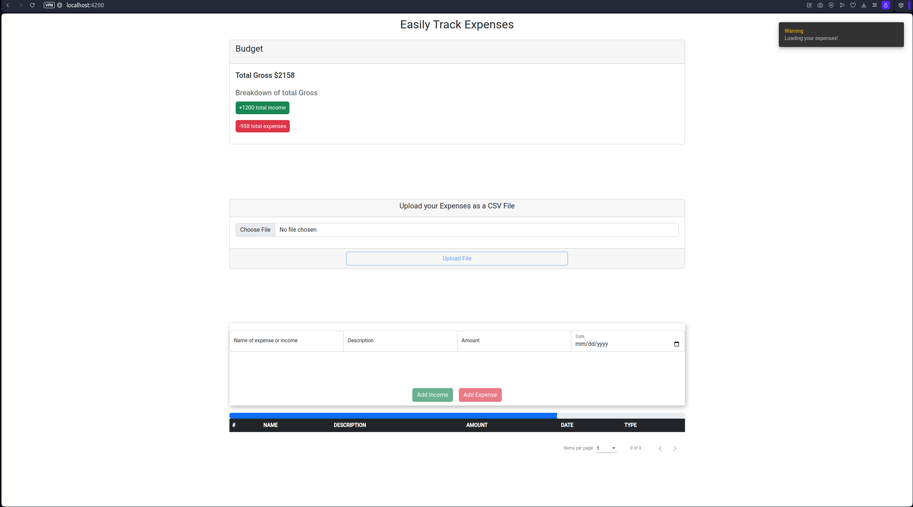
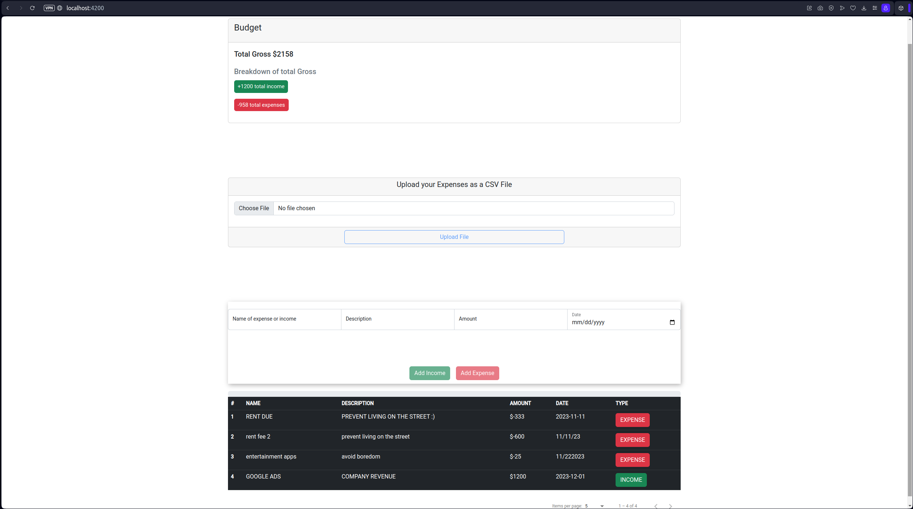
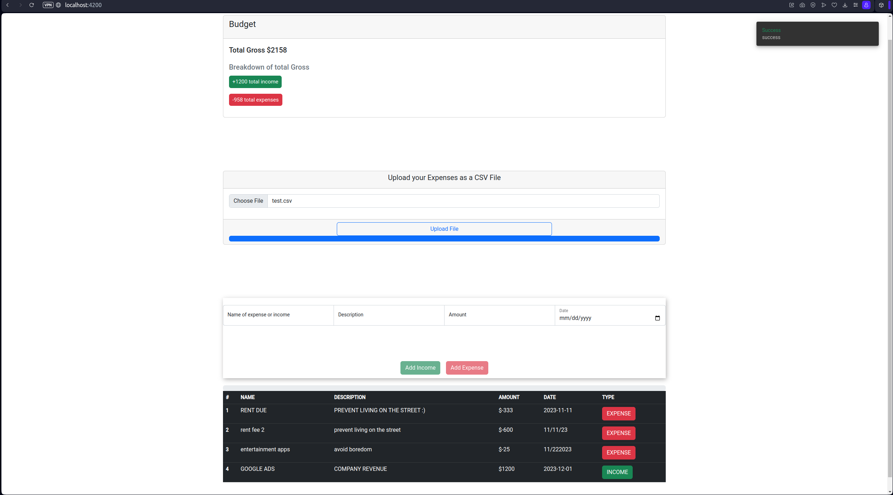

# Easily Tracker App w/ Angular & Flask

-   This simple web app tracks user's expenses and
    allow them to upload a CSV file of expenses they
    wish to track down. Thus, when user upload their
    file, a request would be made to Flask API where
    it would read the file and send it back to
    AngularJS where data would be populate it and as
    well as calculate Income, Expenses and total
    Gross.

-   Tech Stack of this project

### 

### 

### 

### 

### 

## Showcase

## Note

-   Please have in mind that this is only a simple web app project that i created and not built to handle securities vulnerabilities.
-   Also, this project is not deployed on a server due to not being free on Heroku or other platform that offers this type of service.

## Summary

This is simple web app project that I created to better
understand Angular Framework and to refresh my mind
using Flask as the API. Although, the design and colors
of the web page look static, I was more focused on how
Components and data are or could be handle with Angular
and the capabilitities it has to offer, for instance MVC
pattern. Moreover, as I was building this web app and
doing research i learn a few stuff that Angular offers.
For instances;
 
  1. expenses-table.component.scss: This is a SCSS file
specifically use for the compenent. For instance, you'd
have a compoent name 'Expenses-Table', then
expenses-table.component.scss would be use for that
specific component only. Same apply for using
CSS.However, i decided to use SCSS instead of CSS, just
to learn more about it. Although, I'm not a UI person to
make web page look amazing.
 
  2. expenses-table.component.html: A view or variable
created (declared) in the main app.component.html
 
 
3.expenses-tablecomponent.spec.ts: used for testing
expenses-table.component.ts
 
  4. expenses-table.component.ts: This file is what bind
the code or where magic happens to this specific
component. For instance, if we have an user input,
function created in this .ts file that would log user
input.
 
  5. app.module.ts: Now, this file is very important for
the project, whhy you'd ask. Well, this specific file
would run your application and where you define all
services, components etc.
 
  6. index.ts used to define or export project files
 
 
 
Furthermore, Flask handles the API which is just only to
read file data - saves file - then returns that file
contents to Angular which then saves data to
localStorage - populate the data - and calculate the
expenses and total gross.

Author

**Jonathan Jimenez** - Full Stack Developer - [LinkedIn](https://www.linkedin.com/in/jonathan-jimenez101/) | [Website](https://www.jonathanjimenez.tech)
